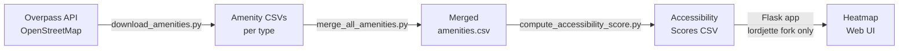

# Project OHANA — Code Investigation Report

**Full Name:** Open-source Heatmap and Analytics for Nationwide Amenities Accessibility  
**Authors:** Same team as Alvarez et al. (2021) — James Sarmiento (`sarmientoj24`) is the original author; `lordjette` maintains a fork with a web UI.

## Repos

| Repo | Commits | Extra | Link |
|---|---|---|---|
| `sarmientoj24/project_ohana` | 6 | Core scripts only | [GitHub](https://github.com/sarmientoj24/project_ohana) |
| `lordjette/project_ohana` | 9 | Adds Flask web UI + heatmap visualization | [GitHub](https://github.com/lordjette/project_ohana) |

## Pipeline Overview



## Core Scripts (all in `scripts/`)

### 1. `download_amenities.py`
- Queries **Overpass API** for OSM amenities by type within a radius around a center point.
- Extracts `id`, `name`, `amenity_type`, `lat`, `lon`.
- Filters out unnamed amenities.
- Saves to CSV.

```
python scripts/download_amenities.py \
  --amenity_type=hospital \
  --origin_x=14.6786 --origin_y=121.0453 \
  --radius=10000
```

### 2. `merge_all_amenities.py`
- Simple `pd.concat` of multiple amenity CSVs into one.

### 3. `compute_accessibility_score.py`
**This is the key script.** Implements Hansen's Gravitation Model:

- **Distance:** Great-circle distance via `geopy.distance.great_circle`
- **Friction coefficient (β):** Default `1.75` (paper uses `2.0` for cities)
- **Max study area:** Configurable radius in km (default `10`)
- **Self-distance:** ⚠️ **Not explicitly handled** — zero-distance amenities will cause divide-by-zero (the normalization step maps [0,1] → [0,1], so a distance of 0 stays 0, then `1/0` → error)
- **Normalization:** Optional, maps distances to [0,1] before applying formula

**Formula implementation:**
```python
scores = normalized_distances ** coeff     # d^β
scores = [1/x for x in scores]             # 1/d^β  (inverse)
return sum(scores)                         # Σ(1/d^β)
```

**Output columns added per centroid:**
- `num_amenities` — count within study area
- `ave_amenity_distance` — mean distance (km) to amenities within study area
- `accessibility_score` — Hansen's gravity score

**Performance:** Supports `modin[ray]` for multi-core parallelization (toggle via `PANDAS_MP` flag).

## Dependencies

| Package | Purpose |
|---|---|
| `fire` | CLI argument parsing |
| `geopy` | Great-circle distance |
| `OSMPythonTools==0.3.2` | OSM data access (unused in scripts?) |
| `requests` | Overpass API calls |
| `pandas` / `modin` | Dataframes + optional parallelization |
| `numpy` | Numerical ops |

## Flask Web UI (lordjette fork only)
- `app.py` → `website/create_app()` 
- 99.9% HTML — likely a Leaflet/Folium-based heatmap viewer
- Deployable via `flask run`

---

## Relevance to Thesis

### What we can directly reuse
1. **`download_amenities.py`** — Download OSM amenities for Cebu by changing `origin_x/y` to Cebu coords (~10.3157, 123.8854) and expanding the radius
2. **Hansen's accessibility score formula** — Can be applied per-property (not per-grid-centroid) to create features for the ML model
3. **Amenity categories** — Health, Finance, Education, Security, Transportation, Grocery (same as the paper)

### What needs adaptation
1. **Per-property, not per-grid:** The tool calculates scores per 1km² grid centroid. For our thesis, we'd compute scores **per Lamudi property location**.
2. **Self-distance bug:** The code doesn't handle `distance == 0`. Need to add a floor (e.g., `max(distance, 0.5)` as in the paper).
3. **Friction coefficient:** Use `β = 2.0` as the paper recommends for urban areas.
4. **Radius:** Paper uses 14.2 km; the code defaults to 10 km. Adjust as needed.
5. **Separate scores per category:** The tool computes one aggregate score. For ML features, we likely want **separate accessibility scores per amenity category** (health_score, finance_score, etc.).

### Concrete next steps (if you want to use this)
1. Download amenities for Cebu (all 6 categories) using `download_amenities.py` with Cebu center coords
2. Adapt `compute_accessibility_score.py` to accept property locations instead of grid centroids
3. Generate per-category accessibility features for the Lamudi dataset
4. Feed features into the ML valuation model
