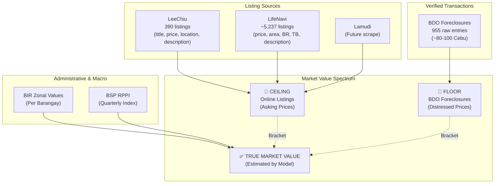
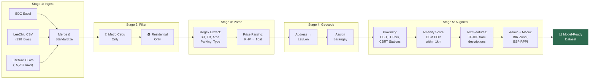

# Mermaid Diagrams — Thesis Proposal Presentation

> Export each diagram as PNG → `thesis_main/Presentations/assets/`

---

## 1. Data Landscape → Use on **Slide 14** (Hybrid Data Strategy)

---

## 2. Data Pipeline → Use on **Slide 15** (Data Pipeline)

