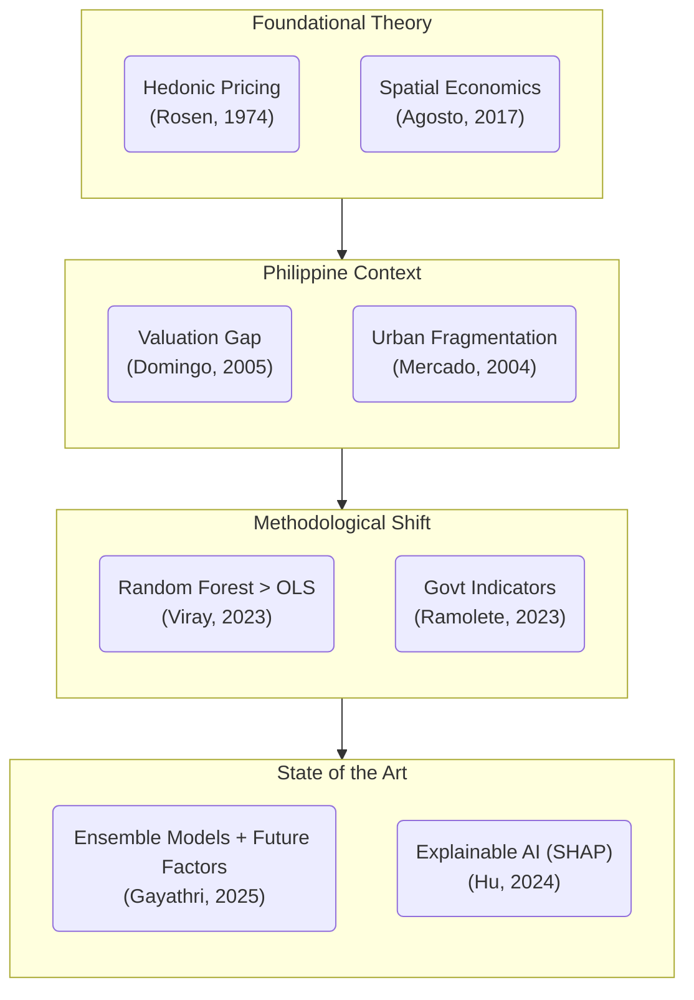
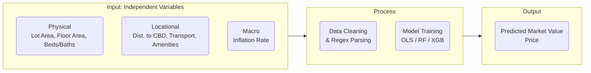
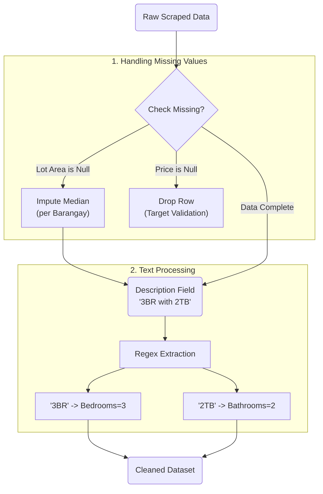

# Thesis Presentation Slides

## Slide 1: Identification Code & Title

**Title:** Data-Driven Property Valuation Factors and Model for Cebu City
**Subtitle:** A Comparative Analysis of Hedonic Regression and Machine Learning Approaches
**Student:** Nico Estreba
**Adviser:** [Adviser Name]
**Date:** December 2025

---

## Slide 2: Introduction

**[Visual: Bullet points with relevant icons]**

* **Real Estate Importance:** Real estate is a key driver of the Philippine economy (6% of GDP).
* **The Problem:** Property valuation in Cebu is currently fragmented:
  * **BIR Zonal Values:** Outdated and often lower than market value.
  * **Bank Appraisals:** Conservative and opaque.
  * **Market Listings:** Highly variable asking prices.
* **The Need:** A transparent, data-driven model to estimate "Fair Market Value" for stakeholders like Cebu Premiere Real Estate (CPRE).
* **The Concept:** Scaling the traditional "Sales Comparison Approach" from 3 comparables to **~1,000 data points** using Machine Learning.

---

## Slide 3: Problem Statement

There is no single, scientifically validated model to estimate residential property values in Cebu City.

* Stakeholders rely on intuition or disjointed data sources.
* Specifically: **"How can we accurately predict the market value of a residential property in Cebu using available data?"**

---

## Slide 4: Research Questions

**[Visual: Numbered List]**

1. **Model Comparison:** Does a Machine Learning model (Random Forest / XGBoost) outperform traditional Hedonic Regression in predicting property prices?
2. **Key Drivers:** What are the most significant determinants of property value in Cebu (e.g., Floor Area vs. Location vs. Proximity to Central Business District/CBD)?
3. **Valuation Gap:** What is the magnitude of the difference between BIR Zonal Values and actual Market Asking Prices?
4. **Future Factors:** How do planned infrastructure projects (Cebu Bus Rapid Transit) capture value in the model?

---

## Slide 5: Research Significance

**[Visual: Icons for each beneficiary]**

* **To the Stakeholder (CPRE):** A decision support tool for pricing advice and investment analysis.
* **To the Academe:** Empirical evidence on the drivers of real estate value in a developing metropolitan city.
* **To Policymakers:** Quantitative data on the lag of Zonal Values, supporting tax reform discussions.

---

## Slide 6: Review of Related Literature (Theories)

**[Visual: Two Pillars]**

* **Hedonic Pricing Theory (Rosen, 1974):** Value is the sum of its parts (Attributes).
  * $P = f(Physical, Locational, Environmental)$
* **Spatial Economics:** "Accessibility" is the primary determinant of land rent (Agosto, 2017).

---

## Slide 7: Review of Related Literature (Empirical)

---

## Slide 8: Conceptual Framework

---

## Slide 9: Methodology - Data Processing

**[Visual: Pipeline Icon]**

1. **Floor Price (Verified):** BDO Foreclosed Assets.
   * *Dataset:* **959 Nationwide** $\rightarrow$ **22 Cebu Properties** (Sparse Verified Baseline).
2. **Ceiling Price (Market):** Web Scraped Listings (Lamudi/DotProperty).
   * *Role:* Solves the "Data Gap" by aggregating thousands of market signals.
3. **Validation (Expert):** Private Brokerage Network.
   * *Role:* "Ground Truth" sanity checks & outlier validation ("Human-in-the-Loop").
4. **Preprocessing:**
   * *Text Mining:* Extracting "3 Bedroom" from description fields.
   * *Geocoding:* Converting addresses to Latitude/Longitude.
5. **Train-Test Split:** 80% Training, 20% Testing (Stratified by City).

---

## Slide 10: Data Cleaning Strategy (Deep Dive)

---

## Slide 11: Feature Engineering (Geospatial)

We go beyond "City" labels by calculating precise vectors:

1. **Distance to CBD (Central Business District):** Haversine distance to Ayala Center Cebu & IT Park.
2. **Distance to Transport:** Proximity to nearest future **CBRT Station**.
3. **Distance to Amenities:** Radius count of Schools and Hospitals within 1km.

* *Hypothesis:* Properties within 500m of a CBRT station will show a "premium" in the model.

## Slide 12: Preliminary EDA (Data Snapshot)

* **Price Distribution:** Highly right-skewed (typical for real estate).
  * *Action:* Log-transform price during training to normalize residuals.
* **Correlation Analysis:**
  * strong positive correlation expected between *Floor Area* and *Price*.
  * Location interaction: The same *Floor Area* in "Lahug" costs 2x more than in "Talisay".

---

## Slide 13: Model Tuning Strategy

We will not use default hyperparameters.

* **GridSearchCV:** Systematic testing of parameter combinations.
* **Random Forest Tuning:**
  * `n_estimators`: [100, 200, 500] (Number of trees).
  * `max_depth`: [10, 20, None] (Preventing overfitting).
* **XGBoost Tuning:**
  * `learning_rate`: [0.01, 0.1, 0.2].
  * `subsample`: [0.8, 1.0].

---

## Slide 14: Methodology - Modeling

**[Visual: Model Icons]**

* **Baseline:** **Ordinary Least Squares (OLS) Regression** (Rosen, 1974).
  * *Pros:* Highly interpretable coefficients.
  * *Cons:* Assumes linearity; fails with complex interactions.
* **Challenger 1:** **Random Forest Regressor** (Breiman, 2001; Viray, 2023).
  * *Pros:* Handles non-linearities and outliers well.
  * *Cons:* Computationally expensive; "Black box" nature makes interpretation harder than OLS.
* **Challenger 2:** **XGBoost (Extreme Gradient Boosting)** (Chen & Guestrin, 2016; Gayathri & Thekkayil, 2025).
  * *Pros:* State-of-the-art accuracy; Gradient-based optimization.
  * *Cons:* Complex hyperparameter tuning required; sensitive to noise/outliers if not regularized.

---

## Slide 15: Empirical Framework (Evaluation)

**[Visual: Formulae for Metrics]**

To evaluate success, we use:

1. **MAE (Mean Absolute Error):** The average "peso error" (e.g., +/- Php 500k).
2. **RMSE (Root Mean Squared Error):** Penalizes large errors more heavily.
3. **R-Squared ($R^2$):** How much variance in price is explained by our features? (Target: > 0.80).

---

## Slide 16: Model Interpretation Strategy (XAI)

**[Visual: SHAP Force Plot]**

* **Global Interpretability:** Feature Importance plots (Random Forest) to identify market drivers (e.g., "Distance to CBD" vs. "Lot Area").
* **Local Interpretability:** SHAP (Shapley Additive Explanations) values to explain *individual* predictions.
  * *Example:* "This specific unit is priced +P500k due to 'Proximity to IT Park'."
* **Why?** Builds trust with stakeholders (CPRE) who may be skeptical of "Black Box" algorithms.

---

## Slide 17: Scope and Limitations

**[Visual: A map of Cebu City]**

* **Scope:**
  * **Geography:** Primarily Cebu City and immediate Metro Cebu neighbors.
  * **Property Type:** Residential (House & Lot, Condominium, Vacant Residential Lot).
  * **Data Source:** Foreclosed assets (distressed value baseline) and Online Listings (market value ceiling).
* **Limitations:**
  * Does not cover commercial or industrial properties.
  * "Market Price" is based on *Asking Price*, not final *Sold Price* (due to privacy of deed of sales).

---

## Slide 18: Timeline

* **Dec - Jan:** Data Collection & Cleaning.
* **February:** Feature Engineering (Geocoding) & "Future Factor" tagging.
* **March:** Model Training & Hyperparameter Tuning.
* **April:** Evaluation, Interpretation, and Final Manuscript.

---

## Slide 19: Ethical Considerations

* **Privacy:** No personal homeowner data is used; only public foreclosure listings.
* **Transparency:** The model is a *guide*, not a mandate. We explicitly state the error margins (MAE).
* **Bias Check:** We will test if the model systematically undervalues specific lower-income barangays (fairness audit).

---

## Slide 20: References

**[Visual: List of key citations (Agosto, Viray, etc.)]**

* **Agosto, N.** (2017). *Determinants of Land Values in Cebu City*.
* **Breiman, L.** (2001). *Random Forests*. Machine Learning, 45, 5-32.
* **Chen, T., & Guestrin, C.** (2016). *XGBoost: A Scalable Tree Boosting System*. KDD '16.
* **Domingo, C., & Fulleros, R.** (2005). *Real Estate Price Index: A Model for the Philippines*.
* **Gayathri, R., & Thekkayil, S.** (2025). *Property Price Prediction using Machine Learning*.
* **Hu, L., et al.** (2024). *Explainable Machine Learning for Real Estate Valuation*. arXiv.
* **Mercado, R., et al.** (2004). *Metro Cebu: A Metropolitan Area in Need of Coordinative Body*. PIDS.
* **Molnar, C.** (2022). *Interpretable Machine Learning*.
* **Ramolete, et al.** (2023). *Enhancing Valuation with Government Indicators*.
* **Rosen, S.** (1974). *Hedonic Prices and Implicit Markets*. Journal of Political Economy.
* **Sousa, R., et al.** (2024). *Exploring Spatial Segmentation from Online Listings*.
* **Viray, J.** (2023). *Machine Learning vs. Hedonic Pricing (Central Pangasinan)*.
* **Wang, D., & Li, V.** (2020). *Deep Learning for Real Estate Valuation: A Survey*.

---

## Slide 21: Q & A

**[Visual: "Thank You" text]**

* Floor open for questions and clarifications.
